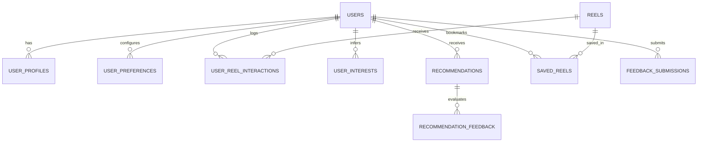

# 🎬 TechReel AI

> **AI-Powered Personalized Technology Reel Recommendation Platform for Students & Developers**
> 
> *Turn your casual scrolling habits into meaningful software engineering, systems architecture, and computer science mastery.*

---

## 🌟 Overview

**TechReel AI** is an intelligent recommendation platform designed specifically for students, aspiring software engineers, and developers. Rather than trapping users in superficial keyword echo-chambers or sensationalized clickbait ("Make $10k with AI in 7 days"), TechReel AI uses a **multi-signal behavioral scoring engine** to detect authentic technology curiosity and connects casual reel scrolls to foundational computer science and systems design concepts.

---

## 🚀 Key Features

- 📱 **Interactive Reel Player & Stream**:
  - Fullscreen vertical video playback with auto-play, looping, and volume/mute controls.
  - Interactive **Code Deep-Dive Tab** showcasing formatted code snippets, execution complexity ($O(1)$, $O(\log n)$, etc.), and key architectural takeaways.
  - Integrated **AI Speech Narration** using Web Speech Synthesis.
  - Keyboard navigation (`↑`/`↓` arrow keys) and playback speed selector (`0.75x`, `1x`, `1.25x`, `1.5x`, `2x`).

- 🧠 **Behavioral Signal Scoring Matrix**:
  - Analyzes watch completion rate, bookmarks, likes, rewatches, shares, and skip rates.
  - Dynamic interest confidence calculation updated in real time.

- 🌉 **AI Bridge Recommendations**:
  - Automatically recommends deep-dive content (e.g. connecting a casual backend meme to *Database Indexing & B-Trees* or *Distributed Cache Invalidation*).
  - Every recommendation includes transparent **"Why" evidence** and difficulty grading (*Beginner*, *Intermediate*, *Advanced*).

- 📊 **Inferred Interest Model & Audit Trail**:
  - Visual breakdown of primary and secondary engineering affinities (System Design, AI & LLMs, Cloud, DSA, Networking, etc.).
  - Complete historical audit log of past AI inference decisions.

- ⚙️ **User Control & Privacy First**:
  - Granular feed personalization toggles, difficulty preferences, and topic exclusions.
  - One-click interest model reset ("Right to Forget") and complete account deletion options.
  - Zero external third-party social tracking—all data remains isolated to your user account.

---

## 📐 Interaction Signal Scoring Formula

TechReel AI evaluates user engagement using a weighted behavioral vector:

$$\text{Signal} = (\text{WatchTime \%} \times 0.8) + (\text{Saved} \times 1.0) + (\text{Liked} \times 0.6) + (\text{Rewatched} \times 0.7) + (\text{Shared} \times 0.5) - (\text{Skipped} \times 0.5)$$

| User Action | Weight Factor | Interpretation |
| :--- | :---: | :--- |
| **Saved Reel** (🔖) | **+1.0** | Highest intent to revisit and study deeper concept |
| **Full Watch Time** (>80%) | **+0.8** | High focus and content retention |
| **Rewatched Reel** (🔄) | **+0.7** | Repeated focus on a specific code block or explanation |
| **Liked Reel** (❤️) | **+0.6** | Positive sentiment for topic or creator |
| **Shared Reel** (🔗) | **+0.5** | Content validation and peer sharing |
| **Skipped** (<25% watched) | **-0.5** | Negative signal; reduces topic prominence |

---

## 🗄️ Database Architecture

The backend implements a fully normalized relational schema across 9 tables:



### Table Definitions:
1. `users` — Authentication credentials, email, password hashes, and timestamps.
2. `user_profiles` — Academic level, career goals, bio, and onboarding status.
3. `user_preferences` — Difficulty settings, content style, excluded topics, and personalization switches.
4. `reels` — Video URLs, titles, categories, difficulty, tags, code snippets, and creator metadata.
5. `user_reel_interactions` — Watch duration %, likes, saves, shares, rewatches, and skip flags.
6. `user_interests` — Inferred interest domains, confidence scores (0.00–1.00), and evidence reasoning.
7. `recommendations` — AI-generated recommendation cards, rationale, and trigger reel linkages.
8. `recommendation_feedback` — User ratings (Useful, Not Useful, Not Interested) and tuning notes.
9. `feedback_submissions` — Platform bug reports, curriculum suggestions, and AI accuracy scores.

---

## 🛠️ Tech Stack

- **Frontend**:
  - [React 19](https://react.dev/) + [TypeScript](https://www.typescriptlang.org/)
  - [Vite](https://vitejs.dev/) for fast builds
  - [Tailwind CSS v4](https://tailwindcss.com/) for modern dark-mode UI
  - [Lucide React](https://lucide.dev/) for consistent iconography
  - [Motion](https://motion.dev/) for smooth UI transitions

- **Backend**:
  - [Node.js](https://nodejs.org/) & [Express.js](https://expressjs.com/)
  - RESTful API endpoints for auth, reels, interactions, preferences, and recommendations
  - Persistent JSON/MySQL relational data engine with automated sample seeding

- **AI Engine**:
  - [@google/genai](https://github.com/google-gemini/deprecations) (Gemini API) with rule-based heuristics fallback
  - 
  


---

## 🚦 Getting Started

### Prerequisites
- Node.js 18+ installed on your system
- npm or yarn package manager

### Installation

1. **Clone the repository**:
   ```bash
   git clone <repository-url>
   cd techreel-ai
   ```

2. **Install dependencies**:
   ```bash
   npm install
   ```

3. **Configure Environment Variables**:
   Create a `.env` file from `.env.example`:
   ```bash
   cp .env.example .env
   ```
   Add your Gemini API key (optional for AI enrichment):
   ```env
   GEMINI_API_KEY="your_api_key_here"
   ```

4. **Start the Development Server**:
   ```bash
   npm run dev
   ```
   The application will start on `http://localhost:3000`.

5. **Build for Production**:
   ```bash
   npm run build
   npm start
   ```

---

## 🔑 Demo Account Credentials

For quick evaluation and testing, you can use the pre-seeded demo account:

- **Email**: `sana@techreel.ai`
- **Password**: `password123`

*(You can also click **"Autofill Demo Account"** on the Login screen or create a new student account at `/register`)*

---

## 🌐 Live URLs

- **Public Preview**: [https://ais-pre-n4fws4fgcucyvgcc7b36q7-385545242161.asia-southeast1.run.app](https://ais-pre-n4fws4fgcucyvgcc7b36q7-385545242161.asia-southeast1.run.app)
- **Development App**: [https://ais-dev-n4fws4fgcucyvgcc7b36q7-385545242161.asia-southeast1.run.app](https://ais-dev-n4fws4fgcucyvgcc7b36q7-385545242161.asia-southeast1.run.app)

---

## 📄 License

This project is licensed under the MIT License.
